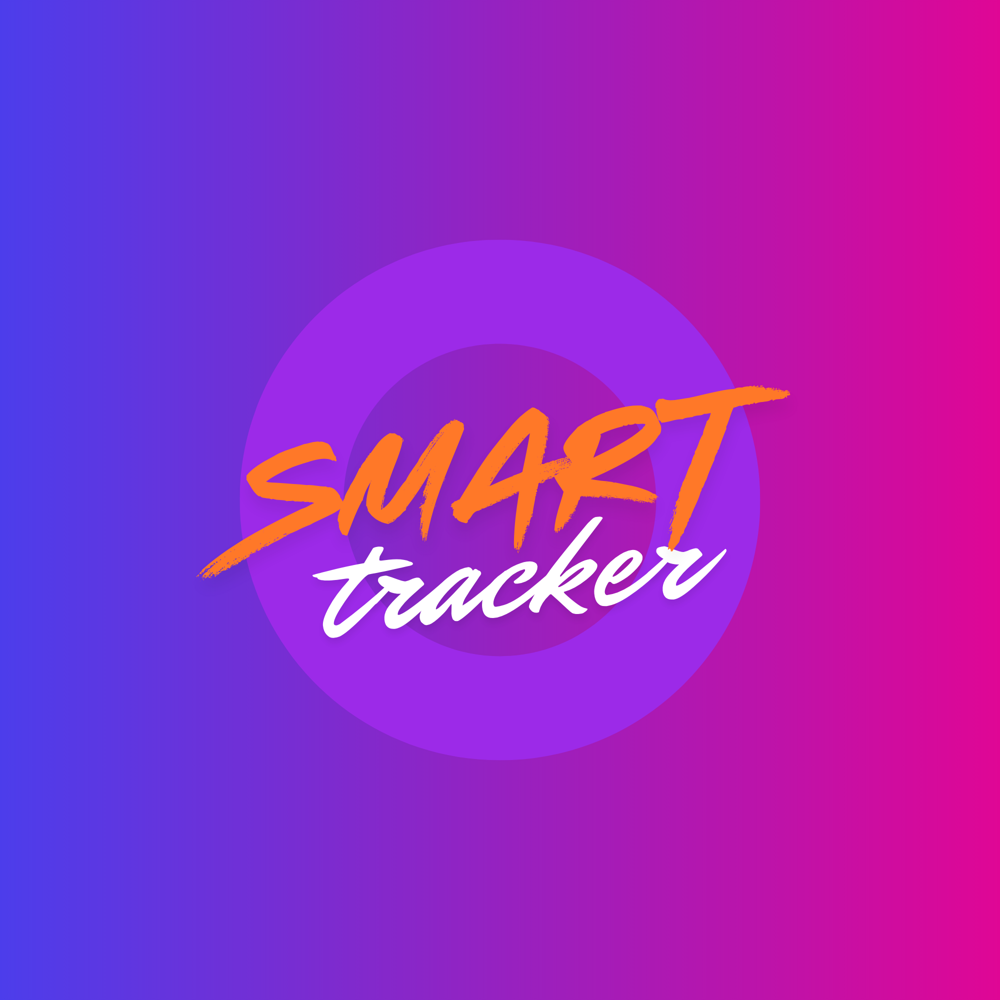
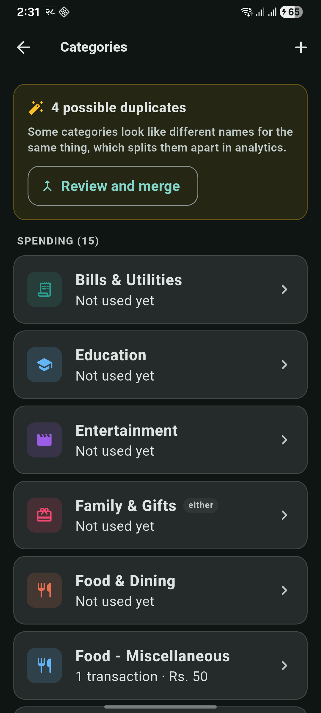
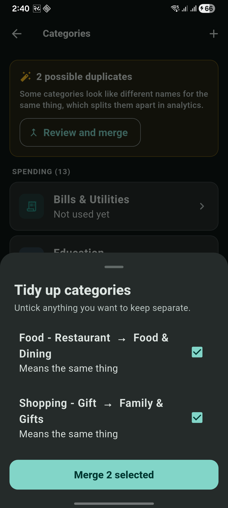
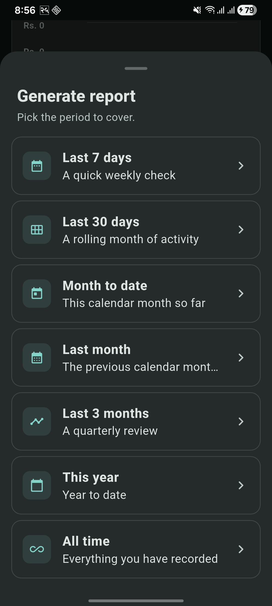
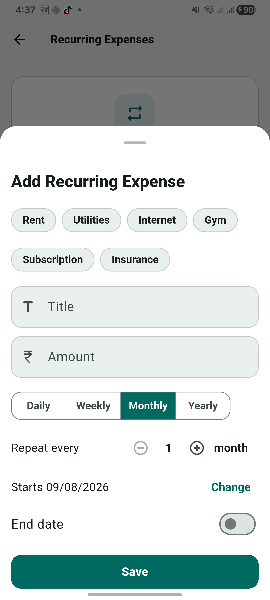
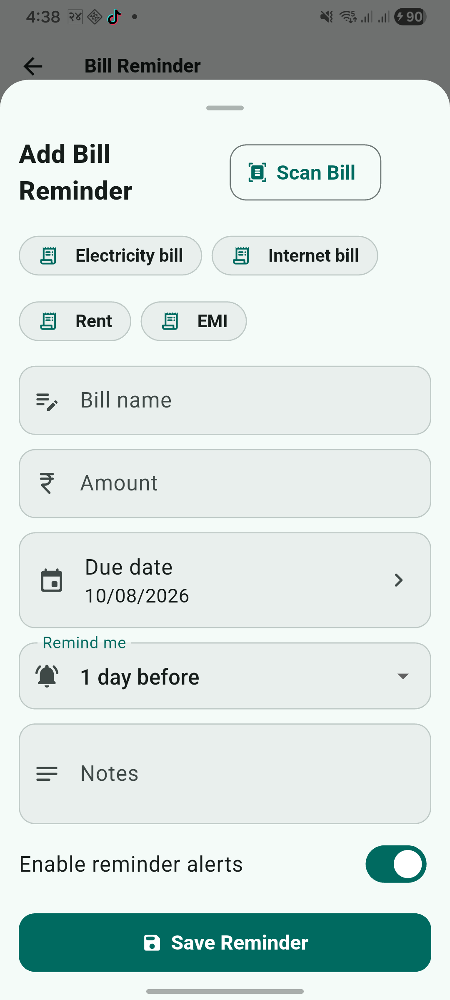
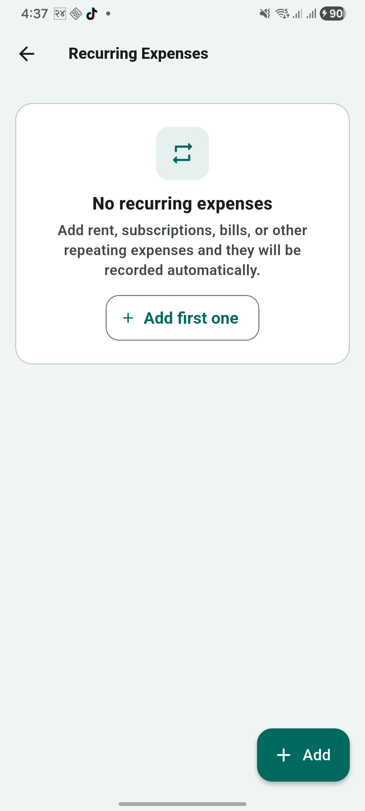

<div align="center">



# Smart Expense

**Track what comes in, see where it goes.**

A personal finance app for Android that records income and spending, explains
the numbers back to you, and exports a report you can actually hand to someone.

[](https://flutter.dev)
[](https://dart.dev)
[](#)
[](https://firebase.google.com)
[](#testing)

</div>

---

## What it does

Most expense apps stop at a list and a pie chart. This one does the arithmetic
properly and then talks to you about it.

- **Log spending in seconds** — type `450 lunch` and it parses the amount,
  direction and category. Or use the full form, or scan a bill.
- **A financial picture that is actually correct** — every figure the app
  quotes is computed in Dart over your full history, not estimated.
- **An assistant that has read your numbers** — it gets an exact brief and is
  told never to invent a figure. It stays friendly, and gets direct when the
  data says you are overspending.
- **Reports worth sharing** — pick a period, read it in-app, export a designed
  multi-page PDF.

## Features

### Recording

| | |
|---|---|
| **Quick add** | Natural-language entry: `spent 500 on lunch`, `got 45k salary` |
| **Manual entry** | Amount, title, category, income/expense |
| **Bill scanning** | On-device OCR (ML Kit) fills a reminder from a photo |
| **Recurring expenses** | Daily to yearly, with automatic catch-up on open |
| **Bill reminders** | Local notifications ahead of a due date |

### Understanding

- **Analytics** — category donut, spending trend, per-category breakdown
- **Reports** — seven periods (last 7/30 days, month to date, last month, last
  3 months, this year, all time), each compared against the equivalent
  preceding window
- **PDF export** — cover band, KPI tiles, category chart, transaction tables,
  observations and page furniture
- **One-off income** — flag a windfall so a single asset sale does not
  masquerade as a 99% savings rate

### The assistant

The model never does arithmetic. `FinancialInsightsService` computes the exact
picture — totals, month-over-month difference, savings rate, burn rate,
runway, category deltas, upcoming commitments — and the model is handed
finished figures with instructions not to recalculate.

Its tone is chosen from those numbers rather than at random:

| Stance | When |
|---|---|
| Calm | Nothing notable |
| Encouraging | Healthy savings rate |
| Watchful | Thin savings, or a large category climbing |
| Strict | Spending above income, or a negative balance |

Strict is deliberately reserved for money genuinely going backwards, so it
keeps its weight.

### Categories

One vocabulary shared by every entry path. When the assistant proposes a
category it is resolved locally against your existing list — exact, then known
synonym, then close spelling — so `Food - Restaurant` and
`Food - Miscellaneous` land on the same category instead of splitting your
food spending in two. A genuinely new category requires confirmation.

Rename, merge and delete are available, plus a duplicate scan for vocabularies
that already drifted.

## Screenshots

<div align="center">

| Categories | Tidy up duplicates | Report periods |
|:---:|:---:|:---:|
|  |  |  |

| Recurring expense | Bill reminder | Empty state |
|:---:|:---:|:---:|
|  |  |  |

</div>

## Getting started

### Prerequisites

- Flutter 3.44 or newer
- A Firebase project with **Authentication** (Email/Password + Google) and
  **Cloud Firestore** enabled

### 1. Clone and install

```bash
git clone https://github.com/Rupak321/Smart-Expense-Tracker.git
cd Smart-Expense-Tracker
flutter pub get
```

### 2. Firebase

Register an Android app in your Firebase project and drop
`google-services.json` into `android/app/`. Then generate the options file:

```bash
dart pub global activate flutterfire_cli
flutterfire configure
```

Google sign-in additionally needs your debug and release **SHA-1/SHA-256**
fingerprints registered in Firebase, or it fails with `sign_in_failed`.

### 3. AI configuration

The assistant needs a [Groq](https://console.groq.com) API key. It is a
**compile-time** define, so a build without it can never reach the API
whatever you change at runtime.

Create `dart_defines.json` in the project root — it is gitignored:

```json
{
  "GROQ_API_KEY": "gsk_your_key_here",
  "GROQ_MODEL": "openai/gpt-oss-20b"
}
```

```bash
flutter run --dart-define-from-file=dart_defines.json
```

> **Everything except the assistant's replies works without a key.**
> Transactions, analytics, reminders, reports and the locally computed
> briefing are all plain Dart over your own data.

> **Models are retired periodically** and a retired model returns an error
> rather than falling back. `llama-3.1-8b-instant` and
> `llama-3.3-70b-versatile` shut down on 16 August 2026. Check
> [Groq's deprecation page](https://console.groq.com/docs/deprecations) if the
> assistant reports its model is unavailable, and set a current one via
> `GROQ_MODEL`.

## Architecture

```
lib/
├── core/
│   ├── categories/      matcher and icon registry
│   ├── components/      shared widgets
│   ├── models/          domain types
│   ├── parser/          natural-language transaction parsing
│   ├── theme/           design tokens, light and dark themes
│   └── utils/           money formatting
├── presentation/
│   ├── screens/         one file per screen
│   └── widgets/         screen-specific widgets
└── services/            Firestore, auth, insights, reports, assistant
```

Two conventions matter:

**Computation is separate from presentation.** `FinancialInsightsService`,
`FinancialReportService` and `CategoryMatcher` expose pure functions that take
their inputs as arguments, so the maths is tested without Firebase or network.

**Design flows through tokens.** `AppTokens` and the `AppColorRoles` extension
name every radius, spacing step and colour role. Cards read `appCard` rather
than `colorScheme.surface`, which is what keeps them visible against the page
in both themes.

## Testing

```bash
flutter test
```

156 tests, covering:

- **Insights and report maths** — totals over full history, month-over-month
  difference, savings rate, burn and runway, period filtering, previous-period
  comparison
- **Category matching** — exact, synonym and fuzzy resolution, direction
  awareness, merge direction, duplicate detection
- **Money formatting** — grouping, compact form, parsing round-trips
- **Layout** — shared components rendered at 320px and the maximum text scale,
  failing on any overflow

## Roadmap

- Budgets and per-category limits
- Transaction editing, search and filtering
- Receipt scanning straight into a transaction
- Savings goals
- CSV export
- Recurring income
- Nepali localisation

## Contributing

Issues and pull requests are welcome. Please run `flutter analyze` and
`flutter test` before opening a PR.

## License

No license has been chosen yet, which means default copyright applies and
others cannot legally reuse the code. Add a `LICENSE` file if you intend it to
be open source.

---

<div align="center">
Built with Flutter.
</div>
